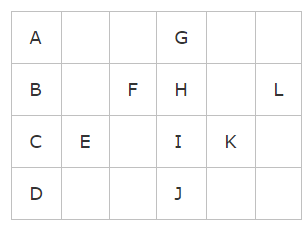

# 6. ZigZag Conversion

The string `"PAYPALISHIRING"` is written in a zigzag pattern on a given number of rows like this: \(you may want to display this pattern in a fixed font for better legibility\)

```text
P   A   H   N
A P L S I I G
Y   I   R
```

And then read line by line: `"PAHNAPLSIIGYIR"`

**Example 1:**

```text
Input: s = "PAYPALISHIRING", numRows = 3
Output: "PAHNAPLSIIGYIR"
```

**Example 2:**

```text
Input: s = "PAYPALISHIRING", numRows = 4
Output: "PINALSIGYAHRPI"
Explanation:

P     I    N
A   L S  I G
Y A   H R
```



**Code:**

```text
class Solution(object):
    def convert(self, s, numRows):
        """
        :type s: str
        :type numRows: int
        :rtype: str
        """
        size = len(s)
        if size <= numRows or numRows == 1:
            return s
        ans = ''
        i = 0
        while i < numRows:
            j = i
            if i == 0 or i == numRows - 1:
                while j < size:
                    ans += s[j]
                    j += 2*numRows - 2
                    if 2 * numRows - 2 == 0:
                        break
            else:
                while j < size:
                    ans += s[j]
                    j += 2*(numRows - i) - 2
                    if j >= size:
                        break
                    ans += s[j]
                    j += 2*i
            i += 1
        return ans
```

对Input标号后，Output为:

```text
n为3时：（0 4 8 12） （1 3 5 7 9 11 13） （2 6 10）
            +4          +2+2              +4 
n为4时：（0 6 12） （1 5 7 11 13） (2 4 8 10)   (3 9)
            +6        +4+2            +2+4     +6
n为5时： （0 8 ）  （1 7 9） （2 6 10）（3 5 11 13） （4 12）
            +8    +6+2=2*4  +4+4=2*4         +2+6       +8
第一行于最后一行每次都是加  2*（numRows-1）
中间行数  先加 2*（numRows-1)-2  再加2*i  （第i行） 依次循环
```

